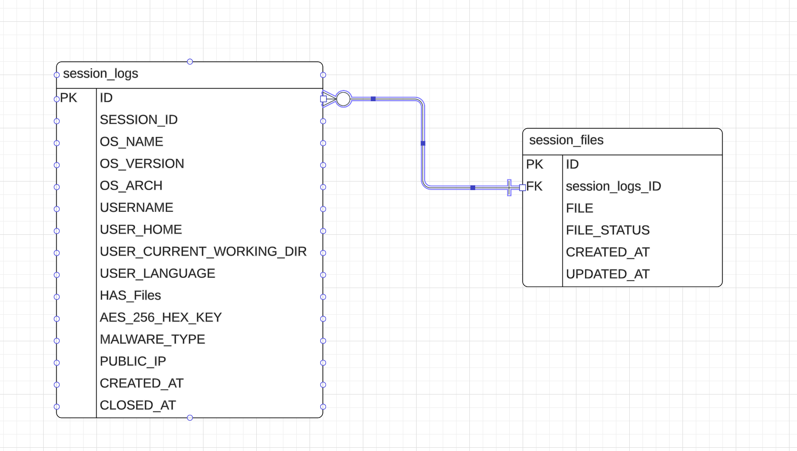

# Command and Control (C2) Server for WebSocket Agents

This Java Spring Boot project serves as a Command and Control server designed to manage connections from WebSocket agents.

## Features

- AWS S3 Integration
- OKTA Integration
- Websocket Support

## Table of Contents

- [Prerequisites](#prerequisites)
- [Installation](#installation)
- [Usage](#usage)
- [Configuration](#configuration)
- [Managing WebSocket Agents](#managing-websocket-agents)
- [Database ERD Diagram](#Database-ERD-Diagram)
- [C2 Components](#C2-Components)

## Youtube Demo
[](https://www.youtube.com/watch?v=EsMQl13e8bs&ab_channel=MohammedHattab)  

## Prerequisites

Before you begin, ensure you have the following prerequisites:

- Java Development Kit 17 (JDK) installed
- Maven installed


## Installation

1. Clone the repository:

    ```bash
    git clone https://github.com/The-Hustler-Hattab/C2JavaServer.git
    ```

2. Navigate to the project folder:

    ```bash
    cd C2JavaServer
    ```

3. Build and run the project using Maven:

    ```bash
    mvn spring-boot:run
    ```

## Usage

The C2 server will be accessible at `http://localhost:8070`. Visit this URL in your web browser or use API clients to interact with the server.  

## Configuration
run schema.sql from resources folder in mysql db to setup db structure.    
Configure the C2 server by editing the `application.properties` file. Update the following properties:

```
# db configs
spring.datasource.password=${SPRING_DATASOURCE_PASSWORD}
spring.datasource.username=${SPRING_DATASOURCE_USERNAME}
spring.datasource.url=${SPRING_DATASOURCE_URL}
# s3 config
aws.s3.key=${KEY}
aws.s3.secret=${SECRET}
aws.s3.bucket-name=${S3BUCKET_NAME}
aws.s3.endpoint=https://s3.us-east-2.amazonaws.com
# okta config
spring.security.oauth2.resourceserver.jwt.jwk-set-uri=${OKTA_JWK_URI}
```

## Managing WebSocket Agents

WebSocket agents can connect to the server using the /reverseshell endpoint. 

## Database-ERD-Diagram

*DB ERD Diagram*


## C2-Components

[C2 UI](https://github.com/The-Hustler-Hattab/c2-ui)  
[C2 Server](https://github.com/The-Hustler-Hattab/C2JavaServer)   
[C2 Java Agent](https://github.com/The-Hustler-Hattab/ReverseShellWebSocketAgent)  
[C2 C# .NET Agent (RECOMMENDED)](https://github.com/The-Hustler-Hattab/WebSocketReverseShellDotNet)  
[Malware Distribution Phishing Page](https://github.com/The-Hustler-Hattab/obs-project-phishing)  

## Contributing
Contributions are welcome!
Please make a pull request for new features
